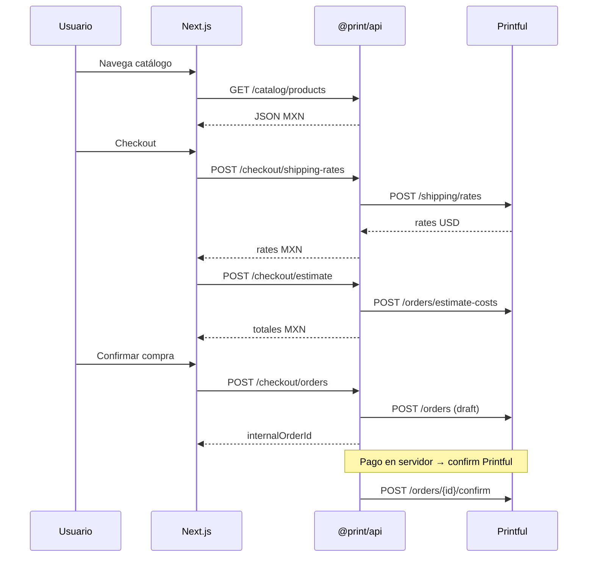

# Orquestación — Tienda POD Printful México

Documento maestro para coordinar agentes (Cursor) y humanos. **Fuente de reglas de negocio:** `.cursorrules` en la raíz.

---

## Estructura monorepo recomendada

```
print/                          # Raíz — Next.js (frontend)
├── app/                        # App Router
├── components/
├── public/
├── packages/
│   └── api/                    # @print/api — Express + Printful
│       ├── package.json
│       ├── tsconfig.json
│       └── src/                # (backend implementa)
│           ├── lib/
│           ├── services/
│           ├── routes/
│           ├── schemas/
│           ├── jobs/
│           └── db/
├── docs/
│   └── ORCHESTRATION.md        # Este archivo
├── .cursor/
│   └── agents/                 # Definiciones de agentes
├── .cursorrules
├── .env.local.example          # Frontend — solo NEXT_PUBLIC_*
├── packages/api/.env.example   # Backend — secretos
├── AGENTS.md
└── pnpm-workspace.yaml         # Recomendado (opcional en scaffold inicial)
```

| Paquete | Ruta | Puerto dev (sugerido) | Responsable |
|---------|------|------------------------|-------------|
| Frontend | `/` (Next) | 3000 | agente `frontend` |
| API | `packages/api` | 4000 | agente `backend` |

### pnpm workspaces (recomendado)

```yaml
# pnpm-workspace.yaml
packages:
  - '.'
  - 'packages/*'
```

Scripts raíz sugeridos (cuando backend exista):

```json
"dev:web": "next dev",
"dev:api": "pnpm --filter @print/api dev",
"dev": "pnpm run dev:api & pnpm run dev:web"
```

---

## Variables de entorno e integración

| Variable | Dónde | Uso |
|----------|--------|-----|
| `NEXT_PUBLIC_*` | Frontend (`.env.local` en raíz) | Solo vars públicas; visibles en el navegador |
| `PORT`, `APP_URL`, secretos | Backend (`packages/api/.env`) | Nunca en el `.env.local` del frontend |

El frontend **solo** conoce `NEXT_PUBLIC_*`. Cualquier clave de pago server-side vive en `packages/api`.

### Tipos compartidos (opcional, fase 2)

Si hace falta compartir DTOs:

```
packages/shared/          # @print/shared — tipos + Zod inferidos
```

Exportar desde schemas del backend o duplicar tipos mínimos en `lib/api-types.ts` del frontend hasta existir `@print/shared`.

---

## Contratos REST (`/api/v1`)

Base: `${NEXT_PUBLIC_API_URL}/api/v1`

### Formato de error (todos los endpoints)

```json
{
  "error": {
    "code": "VALIDATION_ERROR",
    "message": "Descripción en español para UI",
    "details": []
  }
}
```

HTTP: `400` validación, `404` no encontrado, `429` rate limit, `502` Printful upstream.

---

### `GET /health`

Sin prefijo `/api/v1`.

**Response 200**

```json
{ "status": "ok", "service": "@print/api" }
```

---

### `GET /catalog/products`

Lista productos activos para la tienda.

**Query:** `page` (default 1), `limit` (default 24, max 48), `category` (slug de categoría), `q` (búsqueda por nombre/slug/descripción, max 100 chars)

**Response 200**

```json
{
  "data": [
    {
      "id": "uuid-interno",
      "slug": "playera-logo",
      "name": "Playera Logo",
      "thumbnail": "https://...",
      "priceFromMxn": "599.00",
      "variantCount": 12
    }
  ],
  "meta": { "page": 1, "limit": 24, "total": 42 }
}
```

---

### `GET /catalog/products/:id`

`:id` = UUID interno o slug.

**Response 200**

```json
{
  "data": {
    "id": "uuid",
    "name": "Playera Logo",
    "description": "...",
    "thumbnail": "https://...",
    "variants": [
      {
        "syncVariantId": 12345678,
        "size": "M",
        "color": "Negro",
        "retailPriceMxn": "599.00",
        "inStock": true
      }
    ]
  }
}
```

---

### `POST /checkout/shipping-rates`

**Body**

```json
{
  "items": [
    { "syncVariantId": 12345678, "quantity": 2 }
  ],
  "address": {
    "address1": "Av. Insurgentes 123",
    "city": "Guadalajara",
    "stateCode": "JAL",
    "countryCode": "MX",
    "zip": "44100"
  }
}
```

**Response 200**

```json
{
  "data": {
    "rates": [
      {
        "id": "STANDARD",
        "name": "Estándar",
        "priceMxn": "89.00",
        "minDays": 5,
        "maxDays": 14
      }
    ]
  }
}
```

Backend traduce a Printful `POST /shipping/rates` con validación Zod.

---

### `POST /checkout/estimate`

**Body**

```json
{
  "items": [{ "syncVariantId": 12345678, "quantity": 1, "retailPriceMxn": "599.00" }],
  "shippingMethod": "STANDARD",
  "address": { "...": "igual que shipping-rates" }
}
```

**Response 200**

```json
{
  "data": {
    "currency": "MXN",
    "subtotal": "599.00",
    "shipping": "89.00",
    "tax": "109.12",
    "total": "797.12"
  }
}
```

Todos los montos string con 2 decimales. IVA 16% según reglas MX en backend.

---

### `POST /checkout/orders`

Crea pedido Printful en estado **draft**. Genera `internalOrderId` (UUID) como `external_id`.

**Body**

```json
{
  "items": [{ "syncVariantId": 12345678, "quantity": 1, "retailPriceMxn": "599.00" }],
  "shippingMethod": "STANDARD",
  "recipient": {
    "name": "Juan Pérez",
    "address1": "Av. Insurgentes 123",
    "address2": "",
    "city": "Guadalajara",
    "stateCode": "JAL",
    "countryCode": "MX",
    "zip": "44100",
    "phone": "3312345678",
    "email": "juan@ejemplo.mx",
    "taxNumber": "XAXX010101000"
  },
  "retailCosts": {
    "currency": "MXN",
    "subtotal": "599.00",
    "shipping": "89.00",
    "tax": "109.12",
    "total": "797.12"
  }
}
```

**Response 201**

```json
{
  "data": {
    "internalOrderId": "550e8400-e29b-41d4-a716-446655440000",
    "status": "draft",
    "paymentClientSecret": null
  }
}
```

`paymentClientSecret` lo rellena el backend cuando integre Stripe/Conekta (fase pagos). El cobro y `POST /orders/{id}/confirm` en Printful ocurren **solo** tras pago exitoso en servidor.

---

### `GET /orders/:internalOrderId`

**Response 200**

```json
{
  "data": {
    "internalOrderId": "550e8400-e29b-41d4-a716-446655440000",
    "status": "pending",
    "totalMxn": "797.12",
    "trackingNumber": null,
    "trackingUrl": null,
    "shippedAt": null
  }
}
```

Estados expuestos al cliente (simplificados): `draft`, `pending`, `onhold`, `inprocess`, `fulfilled`, `canceled`, `failed`.

---

## Flujo de integración frontend ↔ backend



---

## Secuencia de trabajo por agentes

| Fase | Agente | Entregable | Criterio de done |
|------|--------|------------|------------------|
| 0 | Orquestador | Agentes + este doc + `.env.example` | Contratos fijados |
| 1 | Backend | Scaffold `src/`, DB migrate, `/health` | `curl /health` → ok |
| 2 | Backend | Catalog REST + sync job | List/detail 200 con datos seed o sync |
| 3 | Backend | Checkout (rates, estimate, draft order) | Zod + draft sin confirm |
| 4 | Backend | Webhooks + cola | 200 rápido, worker procesa |
| 5 | Frontend | Landing glass + parallax | Sin secretos |
| 6 | Frontend | Catálogo + PDP + checkout UI | Usa solo `NEXT_PUBLIC_API_URL` |
| 7 | Reviewer | Informe PASS/FAIL | Sin CRITICAL |

---

## Handoffs entre agentes

### Orquestador → Backend

- Contratos en este documento
- `.env.example` completo
- Estructura `packages/api/src/` definida en `.cursorrules`

**Bloquea a frontend si:** API no expone `/health` y al menos un endpoint de catálogo.

### Backend → Frontend

- URL base documentada
- Ejemplos JSON (Postman o sección anterior)
- CORS habilitado para `http://localhost:3000` en dev

**Bloquea a reviewer si:** respuestas no usan MXN string o faltan campos del contrato.

### Frontend → Reviewer

- PR o rama con UI consumiendo API
- `.env.local.example` con `NEXT_PUBLIC_API_URL`

**Bloquea merge si:** reviewer marca CRITICAL.

### Reviewer → Orquestador / equipos

- Informe en `docs/reviews/YYYY-MM-DD.md` (opcional)
- Lista de fixes requeridos por severidad

---

## Lifecycle Printful (recordatorio)

El backend implementa la máquina de estados de `.cursorrules`:

1. Cotizar envío y costos (Printful)
2. Mostrar MXN al cliente (Banxico + buffer)
3. Crear orden **draft**
4. Validar stock/dirección/totales
5. Cobrar (Stripe/Conekta)
6. **Confirmar** en Printful
7. Webhooks actualizan DB y notificaciones

Nunca invertir pasos 5 y 6.

---

## Enlaces

- Agentes: [`.cursor/agents/`](../.cursor/agents/)
- Reglas: [`.cursorrules`](../.cursorrules)
- Índice agentes: [`AGENTS.md`](../AGENTS.md)
